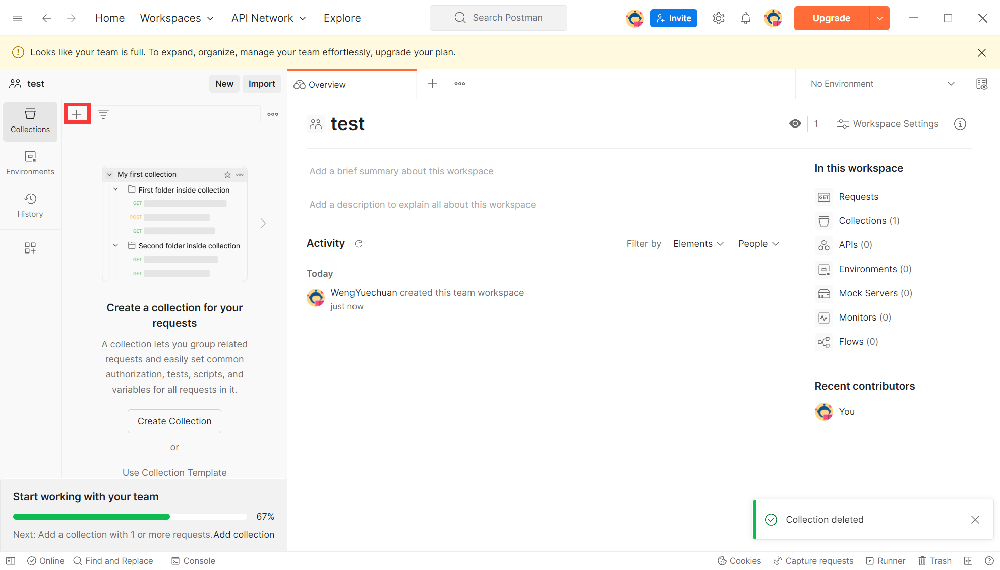

# 对接文档

Author：翁岳川

Time：2023-05-10

Version：1.0.0


## 介绍

提供了各种语言的简单的路由编写方式，返回简单的“Hello world”信息，检测各个组对接的情况。


## 步骤以及代码

### 接口调试工具安装

下载接口调试工具（以下将使用工具 **Postman** 来进行调试，安装地址 [Postman API Platform | Sign Up for Free](https://www.postman.com/)）


安装完成之后得到


注册账号登录后创建workspace


创建接口集合



创建一个新的接口


最后得到下面的结果


现在工具这边就调试到这里，接下来可以编写代码

### 代码编写

下面是使用不同语言和框架编写的简单后端路由，返回 "Hello, World!" 的示例代码：

**Golang + Gin:**

```golang
package main

import (
	"github.com/gin-gonic/gin"
)

func main() {
	router := gin.Default()

	router.GET("/index", func(c *gin.Context) {
		c.String(200, "Hello, World!")
	})

	router.Run(":8080")
}
```


* 安装 Go 编程语言：请访问官方网站 [https://golang.org/](https://golang.org/) ，根据你的操作系统下载并安装 Go。
* 安装 Gin 框架：在终端中运行 `go get -u github.com/gin-gonic/gin` 命令，以安装最新版本的 Gin。

**Python + Flask:**

```python
from flask import Flask

app = Flask(__name__)

@app.route('/index')
def index():
    return 'Hello, World!'

if __name__ == '__main__':
    app.run()
```


* 安装 Python：请访问官方网站 [https://www.python.org/](https://www.python.org/) ，根据你的操作系统下载并安装 Python。
* 安装 Flask：在终端中运行 `pip install flask` 命令，以安装最新版本的 Flask。

**C++ + Crow:**

```Cpp
#include <crow.h>

int main() {
    crow::SimpleApp app;

    CROW_ROUTE(app, "/index")([](){
        return "Hello, World!";
    });

    app.port(8080).multithreaded().run();
}
```


* 安装 C++ 编译器：在 Linux 系统中，通常已经预装了 GCC。在 Windows 系统中，你可以安装 MinGW 或使用其他 C++ 编译器。
* 下载 Crow：你可以在 Crow 的 GitHub 仓库 [https://github.com/ipkn/crow](https://github.com/ipkn/crow) 下载最新版本的 Crow 源代码，并将其添加到你的 C++ 项目中。


**Node.js + Express:**

```javascript
const express = require('express');
const app = express();
const port = 8080;

app.get('/index', (req, res) => {
    res.send('Hello, World!');
});

app.listen(port, () => {
    console.log(`Server running at http://localhost:${port}`);
});
```


* 安装 Node.js：请访问官方网站 [https://nodejs.org/](https://nodejs.org/) ，根据你的操作系统下载并安装 Node.js。
* 创建并初始化 Node.js 项目：在终端中导航到你的项目目录，并运行 `npm init` 命令来创建一个新的 Node.js 项目。按照提示进行配置。
* 安装 Express：在终端中运行 `npm install express` 命令，以安装最新版本的 Express。


**PHP:**

```php
<?php

$app = new \Slim\App();

$app->get('/index', function ($request, $response, $args) {
    return $response->write("Hello, World!");
});

$app->run();
```


* 安装 PHP：请访问官方网站 [https://www.php.net/](https://www.php.net/) ，根据你的操作系统下载并安装 PHP。
* 安装 Composer：请访问官方网站 [https://getcomposer.org/](https://getcomposer.org/) ，根据你的操作系统下载并安装 Composer。
* 创建并初始化 PHP 项目：在终端中导航到你的项目目录，并运行 `composer init` 命令来创建一个新的 PHP 项目。按照提示进行配置。
* 安装 Slim Framework：在终端中运行 `composer require slim/slim` 命令，以安装最新版本的 Slim Framework。


**Java + Spring Boot:**

```java
import org.springframework.boot.SpringApplication;
import org.springframework.boot.autoconfigure.SpringBootApplication;
import org.springframework.web.bind.annotation.GetMapping;
import org.springframework.web.bind.annotation.RestController;

@SpringBootApplication
@RestController
public class HelloWorldApplication {
  
    public static void main(String[] args) {
        SpringApplication.run(HelloWorldApplication.class, args);
    }
  
    @GetMapping("/index")
    public String index() {
        return "Hello, World!";
    }
}
```


* 安装 Java 开发工具包（JDK）：请访问官方网站 [https://www.oracle.com/java/technologies/javase-jdk11-downloads.html](https://www.oracle.com/java/technologies/javase-jdk11-downloads.html) ，根据你的操作系统下载并安装 JDK 11 或更高版本。
* 安装 Apache Maven：请访问官方网站 [https://maven.apache.org/](https://maven.apache.org/) ，根据你的操作系统下载并安装 Apache Maven。
* 创建并初始化 Maven 项目：在命令行中导航到你的项目目录，并运行 `mvn archetype:generate -DgroupId=com.example -DartifactId=helloworld -DarchetypeArtifactId=maven-archetype-quickstart -DinteractiveMode=false` 命令，创建一个新的 Maven 项目。
* 添加 Spring Boot 依赖：在你的 Maven 项目的 `pom.xml` 文件中，添加以下内容：

  ```xml
  <dependencies>
    <dependency>
        <groupId>org.springframework.boot</groupId>
        <artifactId>spring-boot-starter-web</artifactId>
    </dependency>
  </dependencies>
  ```

- 这将添加 Spring Boot Web Starter 依赖项，用于构建 Web 应用程序。
- 构建和运行项目：在项目的根目录中，使用以下命令构建和运行项目：

  ```bash
  mvn clean install
  mvn spring-boot:run
  ```
- 这将使用 Maven 构建项目，并启动 Spring Boot 应用程序。


然后将代码跑在主机上（一般是你将用于作为后端的主机）


### 连接测试

在cmd当中利用 **ipconfig** 指令查询当前代码所运行在的主机的内网ip（注意，如果安装postman的主机和服务器开启的主机不是同一台的话，两台主机需要连接同一个网络才可以互相访问，例如我们可以将两个主机同时连接在bupt-portal上或者同时连接在bupt-mobile上）


然后在postman当中配置你刚才创建的接口


注意中间填写的是http://<你刚才查询出来的地址>:<服务监听的端口号>/index

然后点击发送，得到信息如果是Hello World！则结果正确（我这里使用的是go语言的gin框架执行的）


